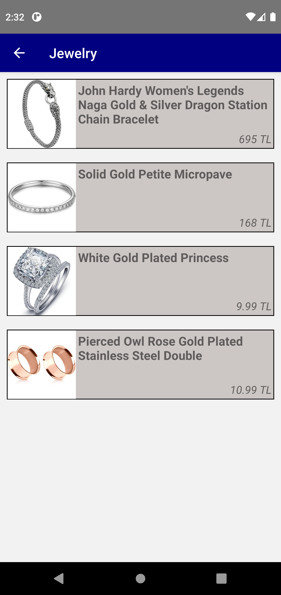

# React-Native-ShoppingApp
 
[Patika.dev](https://app.patika.dev/) Project assignment I developed to reinforce what I learned in React Native trainings.

## Features
- React navigation used
- Switch between pages
- Data was pulled from https://fakestoreapi.com/ with axios
- Clicking on the elements goes to the detail page
- Page loading and error animations added with using lottie package
- All of the products are in a separate category and there is access to all categories from the home page.

## Özellikler
- React navigation kullanıldı
- Sayfalar arası geçiş yapıldı
- Axios ile  https://fakestoreapi.com/ den veri çekildi
- Elemanlara tıklandığı zaman detay sayfasına gider
- Sayfa yükleniyor ve error animasyonları eklendi lottie paketini kullanarak
- Ürünlerin hepsi ayrı kategoride ve ana sayfadan tüm kategorilere erişim var

## Images





## Installation
Clone this repository on your local machine.

```
git clone https://github.com/kubrasambur/React-Native-ShoppingApp.git
```

## Usage
To use it after cloning the project:
```
cd React-Native-ShoppingApp
cd .
```
Run the following commands in the project folder to install the project dependencies.

```
npm init
npm install
```
These instructions will get a copy of the project up and running on your local machine for development and testing purposes.

## To Run the Application
In the project directory you can run:

```
npx react-native run-android
```
## For More Information
You can review the [React Native](https://reactnative.dev/) documentation. 
